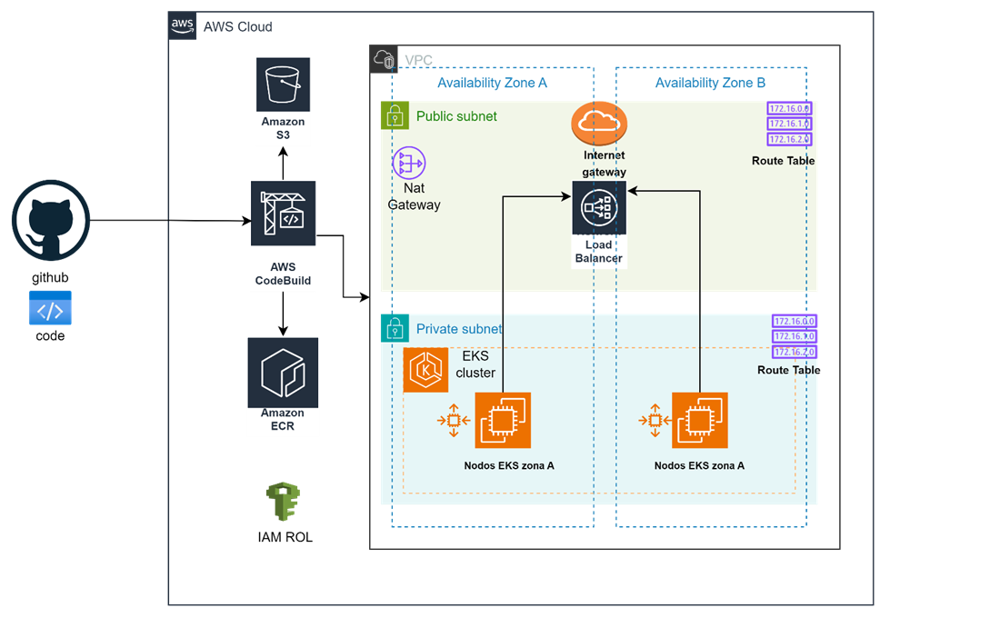
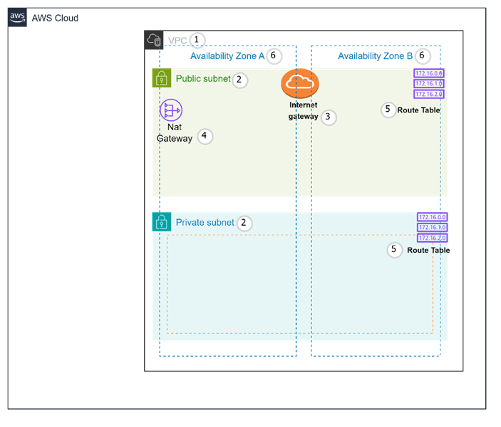

# Proyecto gRPC en EKS

Este proyecto despliega dos aplicaciones en Python que se comunican mediante el protocolo gRPC en un clúster de Amazon Elastic Kubernetes Service (EKS). Las aplicaciones están expuestas a través de un Application Load Balancer (ALB).

## Estructura del Proyecto

- `applications/`: Contiene las aplicaciones gRPC en Python.
- `cicd/`: Contiene la configuración para CodeBuild.
- `k8s/`: Contiene los archivos de configuración de Kubernetes.
- `modules/`: Contiene los módulos de Terraform.
- `terraform/`: Contiene el archivo principal de Terraform que utiliza los módulos.


## Diagrama de Arquitectura



La arquitectura diseñada garantiza un despliegue seguro, escalable y altamente disponible de las aplicaciones gRPC en EKS. La integración de CI/CD, la gestión eficiente de contenedores, el uso estratégico de instancias EC2 con autoescalado y la configuración de red distribuida en múltiples Zonas de Disponibilidad aseguran que la solución cumpla con todos los requisitos del reto técnico de manera eficiente y efectiva.
### Flujo CI/CD y Gestión de Contenedores
Para garantizar un flujo CI/CD eficiente, se integró GitHub con CodeBuild. Cada vez que se realiza un push a la rama principal, CodeBuild se encarga de construir, probar y desplegar automáticamente las aplicaciones en el clúster de EKS. Las imágenes Docker generadas se almacenan y versionan en Amazon Elastic Container Registry (ECR), asegurando una gestión segura y eficiente de los contenedores.
### Uso de EC2 para EKS con Autoescalado
La decisión de utilizar instancias EC2 para desplegar el clúster de EKS se basó en la necesidad de un control granular sobre los recursos y la capacidad de autoescalado. Las instancias EC2 proporcionan flexibilidad en la elección de tipos de instancia, permitiendo optimizar costos y rendimiento según las necesidades específicas de las aplicaciones. Además, el autoescalado asegura que el clúster pueda ajustarse dinámicamente a las cargas de trabajo variables, manteniendo la disponibilidad y el rendimiento sin intervención manual.
### Gestión de Infraestructura con Terraform
Toda la infraestructura se gestiona con Terraform, y el estado se almacena en Amazon S3. Esto no solo permite una gestión consistente y colaborativa de la infraestructura, sino que también asegura que cualquier cambio en la configuración esté sincronizado y versionado adecuadamente.

## Networking del Proyecto gRPC en EKS

El objetivo del reto técnico es desplegar dos aplicaciones en Python que se comuniquen mediante el protocolo gRPC en un clúster de EKS, con la exposición a través de un Application Load Balancer (ALB). La configuración de la red se diseñó para cumplir con estos requisitos, asegurando que las aplicaciones sean seguras, escalables y eficientes.

### Diseño de la Red



1. **VPC**: Se eligió una VPC para proporcionar un entorno de red virtual aislado, garantizando el control total sobre el tráfico de red y la seguridad de los recursos. La VPC permite definir subnets, tablas de rutas y gateways que son esenciales para una infraestructura de red robusta y segura.

2. **Subnets**: Las subnets se dividen en públicas y privadas. Las subnets públicas alojan el ALB, lo que permite que el tráfico de Internet acceda a nuestras aplicaciones. Los nodos de trabajo del clúster de EKS se despliegan en subnets privadas, mejorando la seguridad al restringir el acceso directo desde Internet.

3. **Internet Gateway**: Proporciona acceso a Internet para las subnets públicas, permitiendo que el ALB reciba y responda al tráfico de Internet.

4. **NAT Gateway**: Permite que los nodos en subnets privadas accedan a Internet de manera segura para tareas como actualizaciones del sistema y descargas de dependencias.

5. **Tablas de Rutas**: Configuran el enrutamiento del tráfico dentro de la VPC, dirigiendo el tráfico a través del Internet Gateway y el NAT Gateway según corresponda.

6. **Zonas de Disponibilidad (AZs)**: La infraestructura de red se despliega en dos Zonas de Disponibilidad para asegurar alta disponibilidad y tolerancia a fallos. Esto asegura que las aplicaciones permanezcan accesibles incluso en caso de problemas en una de las zonas.

## Guía de Despliegue

### Prerequisitos

Antes de comenzar, asegúrate de tener instaladas y configuradas las siguientes herramientas en tu máquina local:

- AWS CLI
- Terraform
- Docker
- kubectl
- Git

Además, debes configurar tus credenciales de AWS utilizando `aws configure` para que AWS CLI pueda autenticarte.

### Clonar el Repositorio

Primero, clona el repositorio en tu máquina local:

```bash
git clone https://github.com/zaralexa/grpc-eks-project.git
cd grpc-eks-project
```
### Configurar Secretos en GitHub

Para que AWS CodeBuild pueda acceder a tus recursos de AWS, debes configurar los secretos en GitHub:
1.	Ve a tu repositorio en GitHub.
2.	Haz clic en "Settings".
3.	En el menú lateral, selecciona "Secrets and variables" > "Actions".
4.	Añade los siguientes secretos:
 - `AWS_ACCESS_KEY_ID`
 - `AWS_SECRET_ACCESS_KEY
 - AWS_ACCOUNT_ID
### Despliegue Automático con CodeBuild
Cada vez que realices un push a la rama main, AWS CodeBuild ejecutará el pipeline definido en buildspec.yml para construir y desplegar automáticamente la aplicación en AWS.
### Despliegue Manual
Si prefieres desplegar manualmente, sigue estos pasos:
1. Inicializar y Aplicar Terraform
Navega al directorio terraform y ejecuta los siguientes comandos para inicializar y aplicar la configuración de Terraform, que creará la VPC, subnets, clúster de EKS, repositorio ECR y proyecto de CodeBuild.

```bash
cd terraform
terraform init
terraform apply -auto-approve
```
Este comando creará la infraestructura necesaria en AWS.

2. Construir y Empujar la Imagen Docker
Navega al directorio del servidor y construye la imagen Docker:

```bash
cd ../applications/server
docker build -t grpc-server.
```
Suba la imagen a Amazon ECR. Asegúrate de haber creado el repositorio en ECR como parte del paso anterior de Terraform.

Autenticarse en ECR
```bash
aws ecr get-login-password --region us-east-1 | docker login --username AWS --password-stdin <your-aws-account-id>.dkr.ecr.us-east-1.amazonaws.com
```

Etiquetar y subir la imagen
```bash
docker tag grpc-server:latest <your-aws-account-id>.dkr.ecr.us-east-1.amazonaws.com/grpc-server:latest
docker push <your-aws-account-id>.dkr.ecr.us-east-1.amazonaws.com/grpc-server:latest
```

3. Aplicar Configuraciones de Kubernetes
Navega al directorio k8s y aplica las configuraciones de Kubernetes para desplegar las aplicaciones en el clúster de EKS.
```bash
cd ../../k8s
kubectl apply -f deployment.yaml
kubectl apply -f service.yaml
kubectl apply -f ingress.yaml
```
Estos comandos crean el despliegue, el servicio y la configuración de Ingress para el ALB en tu clúster de EKS.

Verificación del Despliegue
 - Verificar los Pods
 - Verificar el Servicio
 - Verificar el Ingress
```bash
kubectl get pods
kubectl get services
kubectl get ingress
```